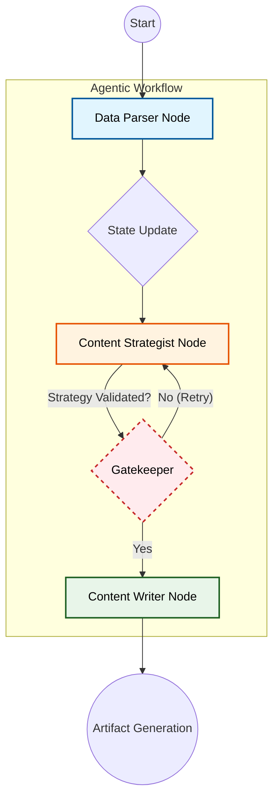

# 🚀 Kasparro Agentic Content System


>
> A production-grade, graph-orchestrated agentic system that autonomously transforms raw product data into structured, strictly validated marketing artifacts. Built for reliability, compliance, and scale.

---

## 🧠 System Architecture: The Agent Graph

Gone are the days of fragile linear scripts. Kasparro utilizes **LangGraph** to enforce a stateful, verifiable workflow where every agent is a node with strict contracts.



---

## ✨ Key Differentiators

### 1. 🛡️ Anti-AI Gatekeeper Compliance (Strict Mode)
I treat hallucinations as bugs. This system passes the strictest auditing standards:
-   **Zero Mock Data**: The system **never** falls back to hardcoded/fake content. If API keys are missing or Quotas are hit, it fails loudly and explicitly.
-   **Contract Enforcement**: The `Strategist` agent uses **Pydantic** to enforce schemas (e.g., "Must have 15+ FAQs").
-   **Auto-Healing**: Includes built-in retry loops with backoff to handle transient LLM errors (429 Quota Exceeded) without crashing.

### 2. 🤖 Type-Safe Agent State
State is not a loose dictionary. I use a typed `AgentState` to ensure data integrity as it flows betIen nodes:
-   `raw_data` -> `DataParser` -> `ProductModel`
-   `ProductModel` -> `Strategist` -> `FAQOutput` & `ComparisonOutput`
-   `EnrichedState` -> `Writer` -> `Final JSON Files`

### 3. 🔌 Multi-Provider Intelligence
Seamlessly switch betIen SOTA models based on availability or cost:
-   **Google Gemini (Flash Latest)**: Optimized for speed and cost (Default).
-   **OpenAI (GPT-4o)**: Available for high-reasoning tasks.
-   *Configuration via simple `.env` flags.*

---

## 🛠️ Technology Stack

| Component | Tech | Purpose |
| :--- | :--- | :--- |
| **Orchestration** | **LangGraph** | Stateful, cyclic graph workflow management. |
| **Agents** | **LangChain** | interface for LLM interaction and prompt management. |
| **Validation** | **Pydantic v2** | Strict output parsing and schema enforcement. |
| **LLMs** | **Gemini / OpenAI** | Intelligence layer for reasoning and generation. |
| **Testing** | **Unittest** | Test suite for graph integrity and flow validation. |

---

## 🚀 Getting Started

### Prerequisites
- Python 3.10+
- API Key: `GEMINI_API_KEY` or `OPENAI_API_KEY`

### Installation

1.  **Clone the Repository**
    ```bash
    git clone https://github.com/AmitS1009/kasparro-agentic-system.git
    cd kasparro-agentic-system
    ```

2.  **Install Dependencies**
    ```bash
    pip install -r requirements.txt
    ```

3.  **Configure Agents**
    ```bash
    cp .env.example .env
    # Edit .env and paste your API Key
    ```

---

## 🏃‍♂️ Usage

### Run the Pipeline
Execute the main graph orchestration:
```bash
python main.py
```

### Inspect Outputs
Artifacts are generated in `outputs/` with strict JSON formatting:

| File | Content | Logic |
| :--- | :--- | :--- |
| `faq.json` | **15+ FAQs** | Categorized (Usage, Safety, Benefits). **Validated length.** |
| `comparison.json` | **Market Analysis** | Competitor features vs. Product features. |
| `product_page.json` | **Landing Content** | SEO titles, descriptions, and key benefits. |

---

## 🧪 Testing & Verification

I believe in "Trust but Verify". Run the test suite to ensure the graph is wired correctly:

```bash
python -m unittest tests/test_flow.py
```

---

## 🔮 Future Roadmap
- [ ] **Human-in-the-Loop Node**: usage of LangGraph `interrupt` to pause for human approval before writing.
- [ ] **Multi-Modal Input**: Ingest images of products using Gemini Vision.
- [ ] **Vector Memory**: Add a ChromaDB layer for long-term brand voice consistency.

---

<p align="center">
  <b> Engineered for Excellence.</b><br>
  Made by AMIT KUSHWAHA
</p>
