# 🚀 Kasparro Agentic Content System


> **A production-grade, modular agentic automation system that autonomously transforms raw product data into structured, machine-readable content pages.**

This project demonstrates **State-of-the-Art (SOTA) Agency** by orchestrating specialized agents to Research, Strategize, and Write content without human intervention. It features a custom **Logic-Aware Template Engine** and **Provider-Agnostic LLM Integration**.

---

## 🧠 System Architecture

The system implements a **Chain-of-Responsibility** pipeline where a shared `Context` object is progressively enriched by specialized agents.

```mermaid
graph LR
    Input[(Raw Data)] --> Parser[🧐 DataParserAgent]
    Parser --> Context{Enriched Context}
    Context --> Strategist[🧠 StrategistAgent]
    
    subgraph "Smarter Strategy"
        Strategist -- "Analyze" --> LLM[OpenAI / Gemini]
        LLM -- "Questions & Insights" --> Strategist
    end
    
    Strategist --> Context
    Context --> Writer[✍️ WriterAgent]
    
    subgraph "Content Assembly"
        Writer -- "Load" --> Templates[📄 JSON Templates]
        Templates -- "Interpolate" --> Logic[⚙️ Logic Blocks]
        Logic --> Writer
    end
    
    Writer --> Output[(📂 JSON Artifacts)]
```



---

## ✨ Key Features

### 1. 🤖 Modular Multi-Agent Architecture
Instead of a monolithic script, the system uses distinct agents with **Single Responsibility Principles**:
- **DataParserAgent**: Cleans, standardizes, and validates dirty input data into strict Pydantic models.
- **ContentStrategistAgent**: The "Brain" that generates user-centric questions and competitive analysis using **LLMs (OpenAI/Gemini)**.
- **ContentWriterAgent**: The "Creator" that synthesizes data into final pages using a logic-driven templating system.

### 2. 🧩 Logic-Aware Template Engine
A custom-built template engine that separates **Design (JSON structure)** from **Data Logic**.
- **Dynamic Interpolation**: Templates use `{logic.block_name}` syntax to call Python functions dynamically.
- **Strict Typing**: Ensures all outputs are valid, machine-readable JSON.

### 3. 🔌 Provider-Agnostic LLM Layer
Seamlessly switch between **OpenAI (GPT-4o)** and **Google Gemini (1.5 Flash)**.
- **Automatic Failover**: If no keys are provided, the system gracefully degrades to a **Heuristic/Mock Strategy** for testing/CI environments.

---

## 🛠️ Technology Stack

- **Core**: Python 3.9+
- **Data Validation**: Pydantic v2
- **AI/LLM**: OpenAI API, Google Generative AI (Gemini)
- **Environment**: Dotenv
- **Pattern**: Pipeline / Chain-of-Responsibility

---

## 🚀 Getting Started

### Prerequisites
- Python 3.9 or higher
- An API Key (OpenAI or Gemini) for AI features (Optional)

### Installation

1.  **Clone the Repository**
    ```bash
    git clone https://github.com/AmitS1009/kasparro-agentic-system.git
    ```

2.  **Install Dependencies**
    ```bash
    pip install -r requirements.txt
    ```

3.  **Configure Environment**
    Copy the example entry and add your keys:
    ```bash
    copy .env.example .env
    ```
    *Add `OPENAI_API_KEY` or `GEMINI_API_KEY` in the `.env` file.*

---

## 🏃‍♂️ Usage

Run the main orchestration pipeline:

```bash
python main.py
```

### 📂 Output
The system generates structured JSON files in the `outputs/` directory:

| Artifact | Description |
|----------|-------------|
| `faq.json` | 15+ generated questions categorized by intent (Usage, Safety, etc.) |
| `product_page.json` | Complete product landing page content with SEO titles. |
| `comparison.json` | Analytical comparison vs. a generated competitor product. |

---

## 📂 Project Structure

```text
├── 📂 docs/                  # Detailed System Design & Documentation
├── 📂 outputs/               # Generated JSON Artifacts
├── 📂 src/
│   ├── 📂 agents/            # Agent Implementations (Parser, Strategist, Writer)
│   ├── 📂 core/              # Base Classes (Agent, Pipeline, Models)
│   ├── 📂 logic/             # Reusable Content Logic Blocks
│   └── 📂 templates/         # JSON Content Templates
├── main.py                   # Orchestration Entry Point
├── requirements.txt          # Dependencies
└── projectdocumentation.md   # Comprehensive System Doc
```

---

## 🔮 Future Improvements
- [ ] **Parallel Execution**: Run agents asynchronously for high-throughput processing.
- [ ] **RAG Integration**: Ingest external PDFs (Manuals/Papers) for deeper fact-checking.
- [ ] **Human-in-the-Loop**: specific reviewer agent to approve content before final JSON generation.

---

<p align="center">
  Made with ❤️ by AMIT KUSHWAHA.
</p>
